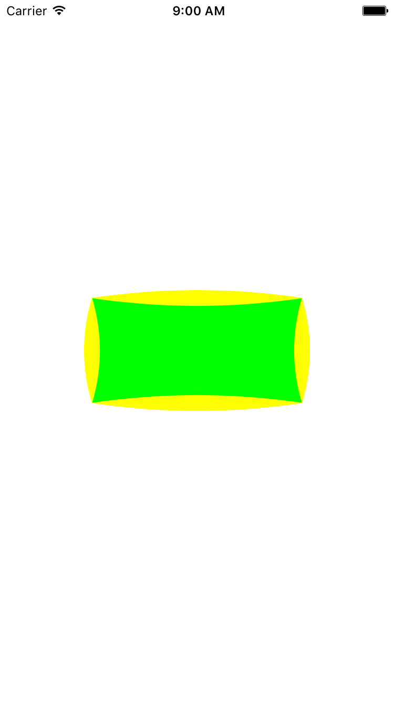

# CALayer-CurveMaker
extension of making curve layers for UIView or CALayer

# Usage

```swift
//init a view
let v = UIView(frame:CGRectMake(30, 40, 200, 100))
view.addSubview(v)
//make curve layer with positions & diretions
/**
positions: 
enum CurvePosition
{
    case CurvePositionTop
    case CurvePositionLeft
    case CurvePositionBottom
    case CurvePositionRight
}
diretions:
enum CurveDirection
{
    case CurveDirectionOutside
    case CurveDirectionInside
}
*/
v.layer.makeCurve(o, position: .CurvePositionLeft, direction: .CurveDirectionOutside, color: UIColor.yellowColor())
```

# Install

- manual import
```swift
just download lib folder and add into your project
```
- cocoaPods
```swift
pod 'CALayer+CurveMaker', '~> 0.0.1'
```

# Screenshot



# Release notes

##### ver 0.0.1

`origin version.`
